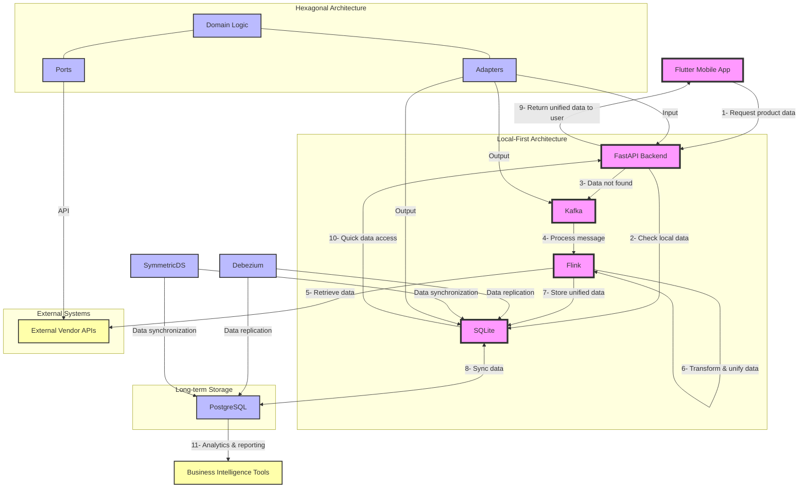

# case study UNIFIED_VENDOR_CATALOG
___

```mermaid
graph TD
    A[Flutter Mobile App] -->|1- Request product data| B[FastAPI Backend]
    B -->|2- Check local data| C[SQLite]
    B -->|3- Data not found| D[Kafka]
    D -->|4- Process message| E[Flink]
    E -->|5- Retrieve data| F[External Vendor APIs]
    E -->|6- Transform & unify data| E
    E -->|7- Store unified data| C
    C <-->|8- Sync data| G[PostgreSQL]

    subgraph "Local-First Architecture"
        B
        C
        D
        E
    end

    subgraph "External Systems"
        F
    end

    subgraph "Long-term Storage"
        G
    end

    H[Debezium] -->|Data replication| C
    H -->|Data replication| G
    I[SymmetricDS] -->|Data synchronization| C
    I -->|Data synchronization| G

    subgraph "Hexagonal Architecture"
        J[Domain Logic]
        K[Adapters]
        L[Ports]
        J --- K
        J --- L
        K -->|Input| B
        K -->|Output| C
        K -->|Output| D
        L -->|API| F
    end

    B -->|9- Return unified data to user| A
    C -->|10- Quick data access| B
    G -->|11- Analytics & reporting| M[Business Intelligence Tools]

    classDef primary fill:#f9f,stroke:#333,stroke-width:4px;
    classDef secondary fill:#bbf,stroke:#333,stroke-width:2px;
    classDef external fill:#ffa,stroke:#333,stroke-width:2px;

    class A,B,C,D,E primary;
    class G,H,I,J,K,L secondary;
    class F,M external;
```