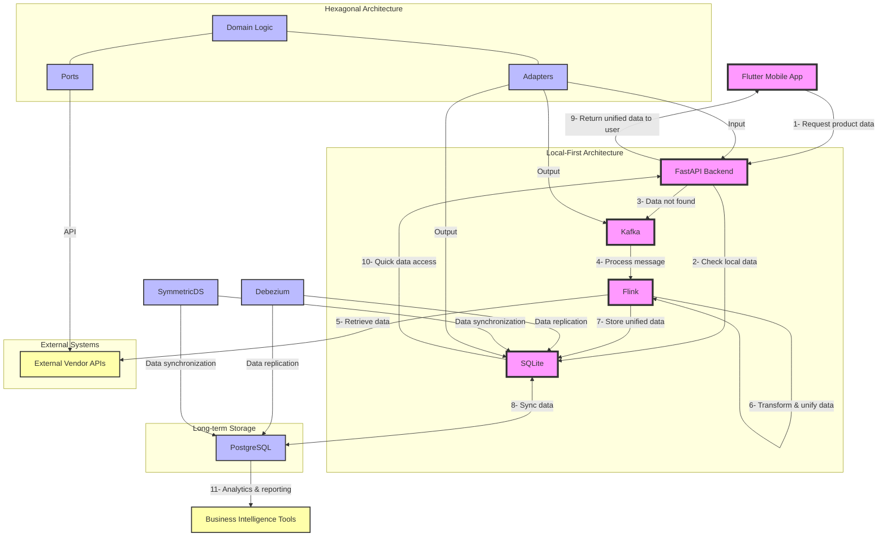
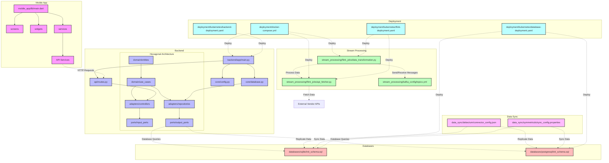

# case study UNIFIED_VENDOR_CATALOG

# Current structure:
multivendor-catalog/
    .gitattributes
    docker-compose.yml
    readme.md
    requirements.txt
    backend/
        app/
            Dockerfile
            main.py
            api/
                routes.py
            core/
                config.py
                database.py
                kafka_producer.py
                postgres_database.py
        flink_jobs/
            debezium_sync.py
            flink_job.py
            debezium_connectors/
                debezium-postgres-connector.json
                debezium-sqlite-connector.json
    databases/
        postgresql/
            init_postgres_schema.sql
        sqlite/
            init_schema.sql
            products.db
            seed_data.sql
    flink/
        Dockerfile
    mobile_app/
        assets/
            images/
                image.png
        lib/
            main.dart
            screens/
                product_list_screen.dart
            services/
    multivendor-catalog/
        .gitattributes

___

Future implemantion plan of Architect and Structure
___
# System Architect
___

___
# System Structure based Architect

